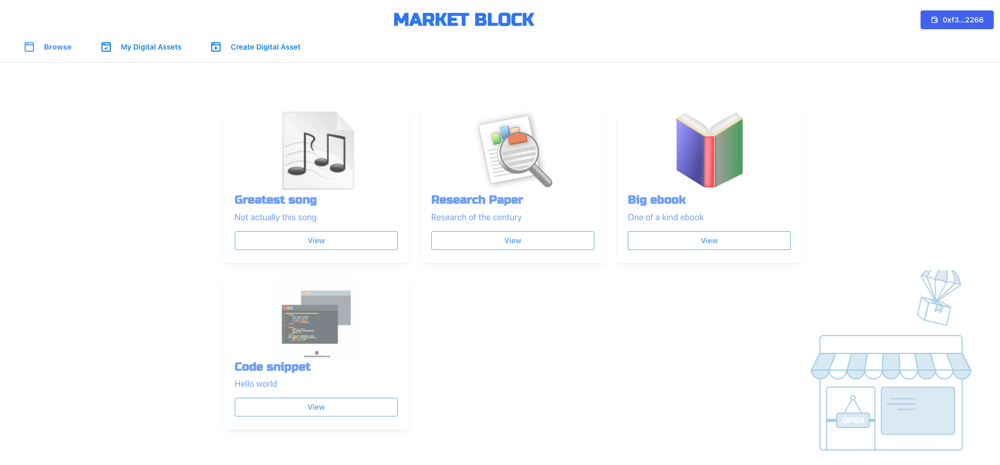

# Market Block


## Description
Built for the L2 Rollathon. Designed for the Polygon network, and making use of IPFS for decentralised uri and file storage.

### TLDR: 
A fungible Digital Asset Market where there is high detailed control of fungible assets. 
For a video preview please check in this repo for:
`Market Block Preview.mov`

### The problem:
Using layer 1 in Etherium to provide a fungible market would incur high transactions fees and would deter some many people from partipating in the market.
Currently bringing digital goods to the blockchain is expensive. 

### The solution
By taking advantage of the high speed and low transaction costs of Polygon, 
it is possible to buy and sell digital assets making the barrier to entry low.
This store has the ability to trade both single or high quantities with a single transaction, including:
- Buying
- Selling
- Approving market control
- Cancelling sale

There are two core contracts.
Fungible - This extends the ERC1155 contract by also allowing quantities of a single token id to be individually approved and transferred.
Market - Allows multiple Fungible contracts to interact with it, also allowing compatability with quantities per single Fungible token id.

## Main Technology Stack
Typescript - For type support throughout the project
Nextjs - Providing full stack server
Hardhat - Contract development and testing
Solidity - Contract language
Sequelize - Easy plugin database support
Mantine - Plug and play UX for Nextjs


## Development Instructions
_Please note this has not been audited or peer reviewed, and is not ready for production._

```shell
# Network and Contracts
cd hardhat
npm install
cp .env.example .env
# Adjust .env values
npm run build
npm run dev
npm run deployContracts

cd ..

# Fullstack server
cd server
npm install
cp .env.example .env.local
# Adjust .env.local values
sequelize db:migrate 
npm start
```

## Credits
Wallpaper
Modified version of the below animation:
https://codepen.io/marianab/pen/XPOQaR

